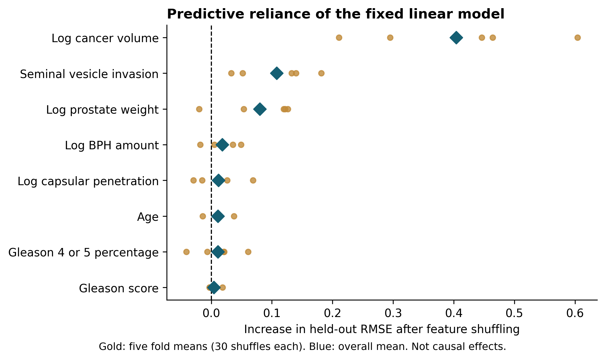

# Responsible and Interpretable Machine Learning for PSA Prediction and Prostate Cancer Risk Modeling

Keely Morris
Department of Computing, East Tennessee State University
Undergraduate Research Honors Program
September 2026

## Abstract

This study examines how the structure of a prostate cancer dataset limits the claims a machine-learning model can support. Part I compares eight regression configurations on a 97-record teaching dataset containing clinical and pathology-related measurements. The outcome is natural-log prostate-specific antigen (PSA). Five-fold cross-validation repeated ten times gives mean root mean squared errors (RMSEs) of 0.731 for ridge regression, 0.733 for ordinary linear regression, and 0.735 for lasso, compared with 1.154 for a training-mean baseline. The small differences between the linear models do not establish that one is reliably superior. Held-out permutation importance for ordinary linear regression identifies log cancer volume as the strongest contributor. These results describe log-PSA prediction within the available sample; they do not validate cancer detection. Part II critically reviews relevant PLCO studies and specifies a future analysis using information available at a defined prediction time. No PLCO patient-level experiment is claimed. Together, the two parts show why model evaluation must consider the population, predictor timing, target, and validation design before connecting numerical performance to a clinical purpose.

Index terms: machine learning, PSA, prostate cancer, cross-validation, interpretability, dataset validity.

## I Introduction

I began this project by comparing machine-learning models on a small prostate cancer dataset. As the work developed, the main question became more specific: what do these models actually predict, and does that prediction match the purpose we want to give it? A model trained to estimate PSA from tumor measurements is answering a different question from a model intended to identify cancer before diagnosis.

The clinical study associated with the teaching data measured preoperative PSA in 102 men and examined prostatectomy specimens [1]. The distributed teaching file used here has 97 records and includes eight predictors, log PSA, and an existing train/test marker [2]. These counts describe different source objects. This paper does not assume that the original clinical study enrolled only 97 men or infer an undocumented reason for the teaching subset.

The research question is: How do dataset structure and predictor timing affect the interpretation and limits of machine-learning results in prostate cancer research? Part I addresses model comparison and interpretability in the available dataset. Part II addresses what a screening-oriented study would need to establish before its results could support a different claim.

TRIPOD+AI provides reporting guidance for prediction-model studies, including descriptions of participants, predictors, outcomes, evaluation, and access to research materials [3]. PROBAST+AI provides a framework for assessing quality, risk of bias, and applicability [4]. These frameworks inform this study's reporting and critique. They are not certifications that the pilot is clinically valid.

The contribution is a reproducible computing case study with a clear boundary around its conclusions. It combines an audited comparison, saved held-out predictions, Python figures, and a concrete design for future work. It does not introduce a new learning algorithm, prove that dataset structure causes a particular performance difference, or establish a new screening tool.

## II Data and evaluation methods

### A Dataset and prediction task

The repository contains 97 rows, eight numeric predictors, the numeric outcome lpsa, and the Boolean train field. The audit found no missing values or duplicate rows. Numeric values matched the official teaching file within an absolute tolerance of 0.000000000001, and the split marker matched after converting T/F to Boolean values. The analysis uses the repository CSV and records its SHA-256 hash.

Participants in the file have a mean age of 63.9 years and an age range of 41 to 79. Mean lpsa is 2.478, with a standard deviation of 1.154. These summaries are computed from the repository data. The predictors are lcavol, lweight, age, lbph, svi, lcp, gleason, and pgg45. Several describe tumor burden or pathology. The target is a continuous log-transformed laboratory measurement, not a cancer diagnosis or a probability of disease.

The train column identifies the historical split of 67 training and 30 test observations [2]. It is excluded because it is metadata rather than a patient characteristic. Its presence alone does not prove target leakage or quantify inflation in earlier scores. More generally, leakage concerns information that is not legitimately available for the intended prediction task [5]. Using the pathology predictors for a claim about pre-diagnostic screening would create a timing mismatch even when the statistical train/test split is correct.

### B Model configurations

Sample-size methodology emphasizes overfitting and precision, rather than a universal minimum number of records [6]. This pilot does not claim to meet a clinical model-development sample-size requirement. Eight configurations were evaluated using scikit-learn [7]. Their settings were fixed for this audit, with no search over the reported outer-fold results. This is an exploratory extension of previously inspected work, not a preregistered comparison.

| Model | Fixed configuration |
|---|---|
| Training-mean baseline | Mean of the training outcomes |
| Ordinary linear regression | Least squares with standardized predictors |
| Ridge | Standardized predictors; alpha = 1.0 |
| Lasso | Standardized predictors; alpha = 0.05; 10,000 iterations maximum |
| Decision tree | Depth 3; minimum leaf size 5 |
| Random forest | 500 trees; depth 4; minimum leaf size 3 |
| Gradient boosting | 100 trees; learning rate 0.03; depth 2; minimum leaf size 5 |
| MLP | One hidden layer of 16 ReLU units; L-BFGS; alpha = 1.0; 4,000 iterations maximum |

All linear predictors are standardized within the training fold. The neural network standardizes both predictors and the target using training-fold values, then returns predictions on the original lpsa scale. The audited MLP uses L-BFGS without early stopping. This differs from the July Adam/early-stopping configuration: in that earlier pipeline, scaling preceded the internal validation split. Outer test observations were still excluded, but the internal early-stopping subset was not fully isolated from preprocessing. The revised configuration removes that additional split. Changes in its performance cannot be attributed to the optimizer alone.

### C Cross-validation and metrics

Every configuration uses the same five-fold partitions, repeated ten times with random seed 42. A fold has 77 or 78 training records and 20 or 19 test records. Each patient receives one held-out prediction per repeat. The full output therefore contains 7,760 predictions: 97 patients, ten repeats, and eight models. These are repeated predictions for the same 97 people, not 7,760 independent patients.

For each test fold, RMSE is the square root of the average squared prediction error; MAE is the average absolute error. Both are reported in log-PSA units. R² compares squared error with variation around that test fold's observed mean. R² can be negative and is not the percentage of patients correctly diagnosed.

Models are ordered by mean fold RMSE. Reported standard deviations describe variation across the 50 overlapping evaluations. They are not confidence intervals, and the folds are not treated as independent samples for significance tests. The script also saves metrics computed from the 97 pooled predictions in each repeat. These differ mathematically from averaging fold metrics and are kept separately.

### D Interpretation and reproducibility

Ordinary linear regression is the fixed model used for interpretation. In the first five held-out folds, each predictor is shuffled 30 times and the resulting change in RMSE is measured. Larger positive values indicate greater predictive reliance. Shuffling correlated features can alter combinations of measurements, so the importance is model- and data-dependent. It is not a causal effect or the probability that a variable is important.

The interpretation folds overlap the evaluation folds. They provide descriptive explanations, not independent confirmation after model selection. Coefficients are also saved for all 50 fitted linear models, in log-PSA units per training-fold predictor standard deviation. Code, data hashes, exact settings, fold assignments, predictions, metrics, and warnings are recorded in the repository. Figure generation reads the saved results and performs no model fitting.

## III Results

### A Model comparison

Table I. Repeated cross-validation results, 50 evaluations per model.

| Model | RMSE mean ± SD | MAE mean ± SD | R² mean ± SD |
|---|---|---|---|
| Ridge | 0.731 ± 0.122 | 0.564 ± 0.105 | 0.538 ± 0.181 |
| Linear Regression | 0.733 ± 0.124 | 0.566 ± 0.106 | 0.535 ± 0.185 |
| Lasso | 0.735 ± 0.103 | 0.578 ± 0.090 | 0.540 ± 0.153 |
| Random Forest | 0.776 ± 0.090 | 0.638 ± 0.077 | 0.494 ± 0.124 |
| Gradient Boosting | 0.790 ± 0.099 | 0.650 ± 0.083 | 0.475 ± 0.140 |
| MLP (L-BFGS) | 0.814 ± 0.134 | 0.622 ± 0.102 | 0.435 ± 0.209 |
| Decision Tree | 0.914 ± 0.120 | 0.759 ± 0.103 | 0.289 ± 0.215 |
| Mean baseline | 1.154 ± 0.152 | 0.902 ± 0.124 | -0.087 ± 0.131 |

Ridge has the lowest mean fold RMSE, but its difference from ordinary linear regression is only 0.0018 log-PSA units. Lasso is also close, and it has the highest mean fold R² of the three. This change in ordering across metrics is one reason to avoid presenting a single model as conclusively best. Across the evaluated settings, the linear models have lower average RMSE than the tree ensembles and the MLP.

Ordinary linear regression reduces mean fold RMSE by 36.4% relative to predicting the training-fold mean. This is a relative reduction in an error metric, not a 36.4% improvement in diagnosis or patient outcomes. The baseline has negative mean R² because it predicts the training mean rather than the unavailable test-fold mean.

Figure 1. RMSE across the 50 held-out folds. Gray dots are fold results; blue markers and bars show the mean and one standard deviation. The bars describe split variability and are not confidence intervals. Data: results/audited/fold_metrics.csv.

### B Predictive behavior and feature reliance

The ordinary linear model's first-repeat predictions and residuals are shown in Fig. 2. Each point is a patient predicted while held out of fitting. This display shows where the model makes larger errors; it does not demonstrate calibration of a cancer-risk probability.

Figure 2. Ordinary linear regression predictions and residuals from the first five-fold repeat, chosen by repeat number rather than visual performance. Data: results/audited/oof_predictions.csv.

Mean held-out permutation importance is 0.404 for log cancer volume, 0.108 for seminal vesicle invasion, and 0.080 for log prostate weight. The mean values for the other predictors are smaller. Fig. 3 shows the five fold means, making the variation across test subsets visible without treating 150 shuffles as 150 independent studies.

Figure 3. Increase in ordinary linear regression RMSE after shuffling each feature. Gold points summarize each held-out fold over 30 shuffles, and blue diamonds show the overall mean. Data: results/audited/permutation_importance_raw.csv.

The supporting coefficient figure in the repository shows how fitted conditional associations vary across folds. Coefficient signs answer a different question from permutation importance. Neither permits a claim that changing one biological measurement would cause a change in PSA.

### C What changed from the earlier analysis

The July five-model analysis was rerun, and its saved summary values reproduced within numerical tolerance. In that comparison, ordinary linear regression had mean RMSE 0.733 and mean R² 0.535. Those values remain unchanged in the expanded audit. The new comparison adds a mean baseline, ridge, and lasso, and replaces the neural-network training configuration. The revised MLP has mean RMSE 0.814. The earlier statement that the neural network was necessarily the least stable or worst-performing model does not describe this new experiment.

## IV Related work and the clinical boundary

The literature review is focused and narrative. It starts with the study suggested by my advisor, follows directly relevant clinical prediction studies, and uses methodological guidance to evaluate their scope. It is not an exhaustive systematic review. Sources are included for the specific populations, outcomes, methods, or principles they support.

A secondary PLCO analysis examined DRE patterns in 34,756 Black and White men using generalized estimating equations [8]. Suspicious DRE findings became more likely closer to diagnosis; the reported interaction odds ratio was 1.230 per year closer to diagnosis. Its methods describe four screening visits, aligned within a ten-year window before or at diagnosis. That is not ten annual examinations for every participant. The study supports investigating longitudinal patterns, but its diagnosis-relative analysis does not independently validate a prospective risk calculator. Using time remaining until a future diagnosis as a deployable predictor would require unavailable information.

A separate study developed one- to five-year cancer-risk models from PLCO and SELECT and evaluated them in 1,790 SABOR participants [9]. The combined model achieved a C-index of 0.76 for any prostate cancer and 0.74 for the paper's higher-grade endpoint, defined as Gleason greater than 7. The authors reported that only 22 higher-grade cases were available in SABOR, preventing evaluation of that endpoint's calibration. This study is a relevant comparator because it defines a future outcome and uses another cohort for evaluation. Its C-index cannot be compared numerically with this pilot's regression R².

Another PLCO study used 8,776 patients already diagnosed with cancer to develop a gradient-boosting model of ten-year prostate cancer mortality [10]. It used a random training/test split and included initial treatment among its predictors. It illustrates an interpretable prognosis task, not early detection. For a prediction supposedly made at diagnosis, treatment information would require a carefully specified availability time. The study's reported performance therefore does not validate this pilot or a pre-diagnostic screening claim.

These studies help explain the boundary of Part I. The original clinical study collected preoperative PSA and subsequently analyzed surgical specimens [1]. Even if pathology measurements predict PSA within that cohort, those measurements do not become available at an earlier screening visit. The pilot also lacks a screening cohort with diagnostic outcomes for both cancer and non-cancer participants. Better RMSE cannot supply the missing outcome, population, or timing information.

## V Proposed PLCO study design

### A Scope and prediction time

Part II contributes a critical review and a proposed protocol. No participant-level PLCO data were obtained or analyzed for this draft. NCI makes documentation available publicly, while access to study data requires an approved project and the applicable data-use agreement [11]. The proposed analysis would need to establish feasibility before making empirical claims.

The proposed primary task is five-year risk of a recorded, confirmed prostate cancer diagnosis among participants without a diagnosis at a defined baseline screening landmark. The landmark would occur when the chosen baseline screening results and questionnaire information are available. A person diagnosed before that point would be excluded. This avoids calling a measurement collected after enrollment a predictor available at enrollment.

NCI's person-level dictionary distinguishes confirmed cancer, diagnosis timing, screening values, and screen-linked biopsy information [12]. The diagnostic-procedure dictionary separately identifies biopsies, procedure dates, and procedure results, and notes that results were collected only on earlier form versions [13]. Consequently, a biopsy-confirmed endpoint cannot be assumed from a biopsy indicator alone. It would require a documented linkage and an assessment of missing procedure results. If that cannot be established, the endpoint must remain recorded confirmed diagnosis.

### B Cohort construction and information timing

| Role | Documented fields | Proposed treatment |
|---|---|---|
| Screening predictors | psa_level0-5; psa_days0-5; dre_result0-3; dre_days0-3 [12] | Use only results available by the landmark. |
| Diagnosis outcome | pros_cancer; pros_cancer_diagdays [12] | Define an event after the landmark, within five years. |
| Verification | biopplink0-5 [12]; biop; proc_days; proc_res [13] | Audit linkage and result availability; exclude future workup from predictors. |
| Validation grouping | plco_id; center [12] | Keep each person's records together; assess center-based validation feasibility. |

This table is a proposed use of documented fields, not an implemented extraction. Prior history and questionnaire variables would also need checks against the landmark date. Missing or not-performed tests must be distinguished from negative findings. Repeated records from one participant must remain together during validation.

People lost before five years without a recorded diagnosis cannot simply be assigned to the negative class. A time-to-event analysis should account for censoring and consider death before diagnosis as a competing event. If a binary five-year analysis is used, its outcome-observation and censoring assumptions must be specified. Model-development guidance discusses defining the intended use, selecting appropriate outcomes, handling missingness, and evaluating clinical usefulness [14]. This protocol applies those principles; it does not claim that merely following a checklist establishes validity.

### C Evaluation and contribution

The future study would begin with a transparent regression or survival baseline and compare additional methods only after cohort and outcome definitions are fixed. All imputation, scaling, feature selection, and tuning would occur inside the relevant training partitions. Existing models and predictor sets would be reviewed before proposing another risk calculator, to determine whether external validation or updating would be more useful than new development.

Evaluation would report discrimination and agreement between predicted and observed risks. Calibration should be assessed directly because good ranking does not ensure accurate absolute probabilities [15]. The proposed analysis would also report overall prediction error and uncertainty, with methods appropriate to the outcome and censoring. Temporal, center-based, or external evaluation would be preferred when feasible. Any subgroup comparison would need adequate observations and events.

If a specific clinical decision and meaningful risk thresholds are defined, decision-curve analysis could compare net benefit with simpler strategies [16]. This remains a future evaluation step. No calibration curve, screening accuracy, or clinical-benefit graph is generated for Part II because no such predictions exist in the repository.

The practical contribution of this chapter is a design that separates baseline information, diagnostic verification, and outcomes. It also identifies a feasibility problem that is easy to overlook: no recorded cancer is not automatically evidence of a negative biopsy. Detection depends partly on who receives diagnostic follow-up, a concern also discussed in the externally evaluated PLCO/SELECT study [9].

## VI Discussion and limitations

The strongest empirical conclusion is modest but useful. On these 97 observations and fixed settings, the linear models perform similarly and have lower average log-PSA error than the more flexible alternatives evaluated here. The sample does not establish that linear models are best for prostate cancer research generally. No hyperparameter search, independent external validation, or prospective assessment was performed. Previous exploration of the same dataset also limits how confirmatory this comparison can be.

Repeated cross-validation makes split sensitivity visible. It does not create new patients, remove selection bias, or turn a small retrospective dataset into a screening population. The smallest errors are observed among several models whose performance is close; their ranking should not be treated as a statistically established hierarchy. The experiment measures associations, and the available variables cannot support a causal analysis or a credible evaluation of screening fairness across populations.

The interpretability analysis helps connect the computation to the data's clinical context. The linear model relies most strongly on cancer volume, with additional reliance on invasion and prostate weight. These measurements help explain the result, but they also show why the model should not be presented as an early-detection system. Calling the target log PSA and keeping the original clinical sample separate from the teaching subset are small reporting choices with substantial consequences for the meaning of the paper.

Part II is limited by the lack of a new PLCO experiment. The review and protocol provide a reasoned next step, not evidence that the proposed model works. Historical screening practices, follow-up patterns, incomplete verification, missing data, and transportability would all need assessment in a completed study. The present work makes no claim of novelty over all published risk models or readiness for patient care.

## VII Conclusion

This project shows what can be learned from the available prostate dataset and where that evidence stops. Ridge, ordinary linear regression, and lasso have similar repeated-validation performance for predicting log PSA. The repository supports that finding with saved predictions, metrics, and reproducible figures. It does not support a claim that these models detect cancer early.

The connection between the two thesis parts is the prediction question itself. Part I evaluates a clearly defined task using the data I have. Part II explains how the data and evaluation would need to change before addressing future diagnosis. Responsible machine learning requires both sound computation and a conclusion that matches the information actually available.

## Reproducibility

The audited analysis is generated by run_audited_analysis.py, and the four figures are generated by make_thesis_figures.py. Results are stored under results/audited/. The earlier five-model results remain under results/research/. Exact settings, package versions, data and script hashes, and warnings are recorded in run_metadata.json. The repository was private at review time; readers need access to inspect the code. The current advisor draft is tracked in [the research pull request](https://github.com/keelym8rris/research-methods-morris/pull/1). The accompanying claim-to-source audit identifies verification depth and limits for each cited source.

## References

[1] T. A. Stamey et al., “Prostate specific antigen in the diagnosis and treatment of adenocarcinoma of the prostate. II. Radical prostatectomy treated patients,” J. Urol., vol. 141, no. 5, pp. 1076–1083, 1989, doi: 10.1016/S0022-5347(17)41175-X. [Read source](https://pubmed.ncbi.nlm.nih.gov/2468795/).

[2] T. Hastie, “Prostate data info,” The Elements of Statistical Learning datasets. Accessed: Sep. 11, 2026. [Online]. Available: [Read source](https://hastie.su.domains/ElemStatLearn/datasets/prostate.info.txt).

[3] G. S. Collins et al., “TRIPOD+AI statement: Updated guidance for reporting clinical prediction models that use regression or machine learning methods,” BMJ, vol. 385, Art. no. e078378, 2024, doi: 10.1136/bmj-2023-078378. [Read source](https://pmc.ncbi.nlm.nih.gov/articles/PMC11019967/).

[4] K. G. M. Moons et al., “PROBAST+AI: An updated quality, risk of bias, and applicability assessment tool for prediction models using regression or artificial intelligence methods,” BMJ, vol. 388, Art. no. e082505, 2025, doi: 10.1136/bmj-2024-082505. [Read source](https://pmc.ncbi.nlm.nih.gov/articles/PMC11931409/).

[5] S. Kaufman, S. Rosset, C. Perlich, and O. Stitelman, “Leakage in data mining: Formulation, detection, and avoidance,” ACM Trans. Knowl. Discov. Data, vol. 6, no. 4, pp. 1–21, Dec. 2012, doi: 10.1145/2382577.2382579. [Read source](https://dl.acm.org/doi/10.1145/2382577.2382579).

[6] R. D. Riley et al., “Minimum sample size for developing a multivariable prediction model: Part I—Continuous outcomes,” Stat. Med., vol. 38, no. 7, pp. 1262–1275, 2019, doi: 10.1002/sim.7993. [Read source](https://doi.org/10.1002/sim.7993).

[7] F. Pedregosa et al., “Scikit-learn: Machine learning in Python,” J. Mach. Learn. Res., vol. 12, pp. 2825–2830, 2011. [Read source](https://jmlr.org/papers/v12/pedregosa11a.html).

[8] K. Guan et al., “Ten-year trends in digital rectal exam results and prostate cancer detection: Insights from the PLCO trial,” Res. Rep. Urol., vol. 17, pp. 309–320, 2025, doi: 10.2147/RRU.S542550. [Read source](https://pmc.ncbi.nlm.nih.gov/articles/PMC12405719/).

[9] J. A. Gelfond et al., “Prediction of future risk of any and higher-grade prostate cancer based on the PLCO and SELECT trials,” BMC Urol., vol. 22, Art. no. 45, 2022, doi: 10.1186/s12894-022-00986-w. [Read source](https://link.springer.com/article/10.1186/s12894-022-00986-w).

[10] J.-E. Bibault et al., “Development and validation of an interpretable artificial intelligence model to predict 10-year prostate cancer mortality,” Cancers, vol. 13, no. 12, Art. no. 3064, 2021, doi: 10.3390/cancers13123064. [Read source](https://pmc.ncbi.nlm.nih.gov/articles/PMC8234681/).

[11] National Cancer Institute, “Prostate datasets,” Cancer Data Access System. Accessed: Sep. 11, 2026. [Online]. Available: [Read source](https://cdas.cancer.gov/datasets/plco/20/).

[12] National Cancer Institute, “Prostate Person (pros_prsn) Data Dictionary,” Oct. 15, 2024. Accessed: Sep. 11, 2026. [Online]. Available: [Read source](https://cdas.cancer.gov/files/download/pcvhtvubq8/pros-dictionary-t20241011.pdf).

[13] National Cancer Institute, “Prostate Diagnostic Procedures (pros_proc) Data Dictionary,” Oct. 15, 2024. Accessed: Sep. 11, 2026. [Online]. Available: [Read source](https://cdas.cancer.gov/files/download/k1vmy6z99q/pros_proc-dictionary-t20241011.pdf).

[14] O. Efthimiou, M. Seo, K. Chalkou, T. Debray, M. Egger, and G. Salanti, “Developing clinical prediction models: A step-by-step guide,” BMJ, vol. 386, Art. no. e078276, 2024, doi: 10.1136/bmj-2023-078276. [Read source](https://pmc.ncbi.nlm.nih.gov/articles/PMC11369751/).

[15] B. Van Calster, D. J. McLernon, M. van Smeden, L. Wynants, and E. W. Steyerberg, “Calibration: The Achilles heel of predictive analytics,” BMC Med., vol. 17, Art. no. 230, 2019, doi: 10.1186/s12916-019-1466-7. [Read source](https://pmc.ncbi.nlm.nih.gov/articles/PMC6912996/).

[16] A. J. Vickers and E. B. Elkin, “Decision curve analysis: A novel method for evaluating prediction models,” Med. Decis. Making, vol. 26, no. 6, pp. 565–574, 2006, doi: 10.1177/0272989X06295361. [Read source](https://pmc.ncbi.nlm.nih.gov/articles/PMC2577036/).
