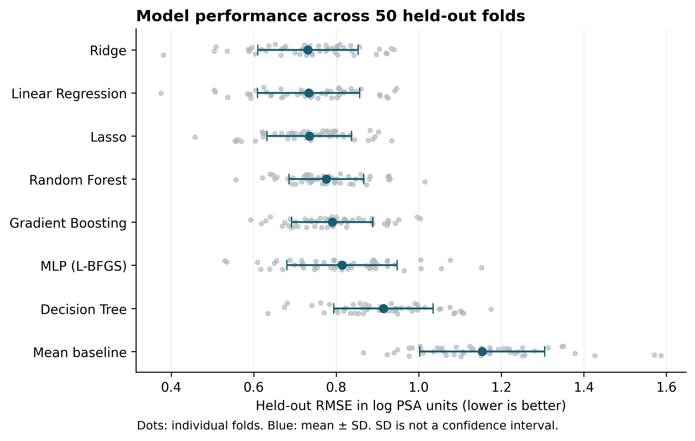
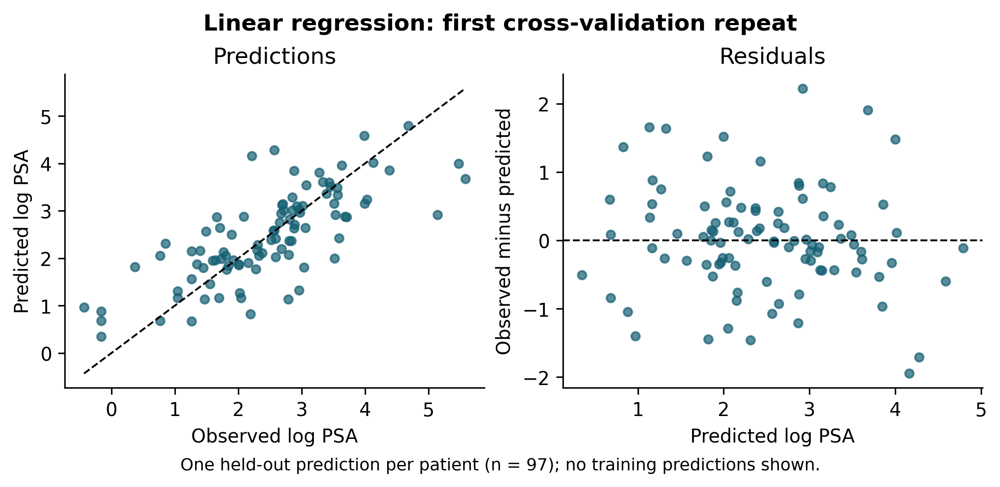

# From PSA Prediction to Prostate Cancer Risk: Matching Machine Learning Claims to the Data

Keely Morris
Department of Computing, East Tennessee State University
Undergraduate Research Honors Program
September 2026

## Abstract

This study examines how the structure of a prostate cancer dataset limits the claims a machine-learning model can support. Part I compares eight regression configurations on a 97-record teaching dataset containing clinical and pathology-related measurements. The outcome is natural-log prostate-specific antigen (PSA). Five-fold cross-validation repeated ten times gives mean root mean squared errors (RMSEs) of 0.731 for ridge regression, 0.733 for ordinary linear regression, and 0.735 for lasso, compared with 1.154 for a training-mean baseline. The small differences between the linear models do not establish that one is reliably superior. Held-out permutation importance for ordinary linear regression identifies log cancer volume as the strongest contributor. These results describe log-PSA prediction within the available sample; they do not validate cancer detection. Part II reviews screening, diagnostic imaging, and prognosis studies and compares the reliability of datasets used before and after diagnosis. No PLCO patient-level experiment is claimed. Together, the two parts show why model evaluation must consider the population, predictor timing, target, and validation design before connecting numerical performance to a clinical purpose.

Index terms: machine learning, PSA, prostate cancer, cross-validation, interpretability, dataset validity.

## I Introduction

I began this project by comparing machine-learning models on a small prostate cancer dataset. As the work developed, the main question became more specific: what do these models actually predict, and does that prediction match the purpose we want to give it? A model trained to estimate PSA from tumor measurements is answering a different question from a model intended to identify cancer before diagnosis.

The distributed teaching file contains 97 records, eight predictors, log PSA, and a historical train/test marker [1]. Its measurements make it useful for comparing regression methods. They also raise a practical question: would these same measurements be available at the point when someone is being screened?

The research question is: How do dataset structure and predictor timing affect the interpretation and limits of machine-learning results in prostate cancer research? Part I provides descriptive analysis, compares predictive models, and discusses the strengths and limitations of each algorithm. Part II reviews published work on prostate cancer risk and detection, then examines the reliability of datasets collected at different points in care.

TRIPOD+AI provides reporting guidance for prediction-model studies, including descriptions of participants, predictors, outcomes, evaluation, and access to research materials [2]. PROBAST+AI provides a framework for assessing quality, risk of bias, and applicability [3]. These frameworks inform this study's reporting and critique. They are not certifications that the pilot is clinically valid.

My goal is to connect the computing work to a question that matters: how much can we reasonably learn from the data we have? The contribution is a reproducible model comparison alongside a focused review of how population, measurement timing, and outcome definitions change the meaning of a prediction.

## II Part I: Descriptive analysis and predictive methods

### A Dataset and prediction task

The repository contains 97 rows, eight numeric predictors, the numeric outcome lpsa, and the Boolean train field. Data checks found no missing values or duplicate rows. Numeric values matched the official teaching file within an absolute tolerance of 0.000000000001, and the split marker matched after converting T/F to Boolean values. The analysis uses the repository CSV and records its SHA-256 hash.

Participants in the file have a mean age of 63.9 years and an age range of 41 to 79. Mean lpsa is 2.478, with a standard deviation of 1.154. These summaries are computed from the repository data. The predictors are lcavol, lweight, age, lbph, svi, lcp, gleason, and pgg45. Several describe tumor burden or pathology. The target is a continuous log-transformed laboratory measurement, not a cancer diagnosis or a probability of disease.

The train column identifies the historical split of 67 training and 30 test observations [1]. It is excluded because it is metadata rather than a patient characteristic. Its presence alone does not prove target leakage or quantify inflation in earlier scores. Using the pathology predictors for a claim about pre-diagnostic screening would create a timing mismatch even when the statistical train/test split is correct.

Table I. Descriptive statistics for the 97 observations. Values remain on the scales stored in the dataset.

| Variable | Mean ± SD | Minimum | Maximum |
|---|---|---|---|
| lcavol | 1.350 ± 1.179 | -1.347 | 3.821 |
| lweight | 3.629 ± 0.428 | 2.375 | 4.780 |
| age | 63.866 ± 7.445 | 41.000 | 79.000 |
| lbph | 0.100 ± 1.451 | -1.386 | 2.326 |
| svi | 0.216 ± 0.414 | 0.000 | 1.000 |
| lcp | -0.179 ± 1.398 | -1.386 | 2.904 |
| gleason | 6.753 ± 0.722 | 6.000 | 9.000 |
| pgg45 | 24.381 ± 28.204 | 0.000 | 100.000 |
| lpsa | 2.478 ± 1.154 | -0.431 | 5.583 |

The mean of the binary svi variable corresponds to 21 of 97 observations with svi = 1. These summaries describe this sample; they are not population estimates of prostate cancer risk.

### B Model configurations

The small sample limits the precision and generalizability of the comparison. Eight configurations were evaluated using scikit-learn [4]. Their settings were fixed for this comparison, with no search over the reported outer-fold results. This is an exploratory extension of previously inspected work, not a preregistered comparison.

| Model | Fixed configuration |
|---|---|
| Training-mean baseline | Mean of the training outcomes |
| Ordinary linear regression | Least squares with standardized predictors |
| Ridge | Standardized predictors; alpha = 1.0 |
| Lasso | Standardized predictors; alpha = 0.05; 10,000 iterations maximum |
| Decision tree | Depth 3; minimum leaf size 5 |
| Random forest | 500 trees; depth 4; minimum leaf size 3 |
| Gradient boosting | 100 trees; learning rate 0.03; depth 2; minimum leaf size 5 |
| MLP | One hidden layer of 16 ReLU units; L-BFGS; alpha = 1.0; 4,000 iterations maximum |

All linear predictors are standardized within the training fold. The neural network standardizes both predictors and the target using training-fold values, then returns predictions on the original lpsa scale. The MLP uses L-BFGS without an internal early-stopping split. Its configuration differs from the neural network in the earlier exploratory analysis, so their results should not be interpreted as an isolated comparison of optimizers.

### C Cross-validation and metrics

Every configuration uses the same five-fold partitions, repeated ten times with random seed 42. A fold has 77 or 78 training records and 20 or 19 test records. Each patient receives one held-out prediction per repeat. The full output therefore contains 7,760 predictions: 97 patients, ten repeats, and eight models. These are repeated predictions for the same 97 people, not 7,760 independent patients.

For each test fold, RMSE is the square root of the average squared prediction error; MAE is the average absolute error. Both are reported in log-PSA units. R² compares squared error with variation around that test fold's observed mean. R² can be negative and is not the percentage of patients correctly diagnosed.

Models are ordered by mean fold RMSE. Reported standard deviations describe variation across the 50 overlapping evaluations. They are not confidence intervals, and the folds are not treated as independent samples for significance tests. The script also saves metrics computed from the 97 pooled predictions in each repeat. These differ mathematically from averaging fold metrics and are kept separately.

### D Interpretation and reproducibility

Ordinary linear regression is the fixed model used for interpretation. In the first five held-out folds, each predictor is shuffled 30 times and the resulting change in RMSE is measured. Larger positive values indicate greater predictive reliance. Shuffling correlated features can alter combinations of measurements, so the importance is model- and data-dependent. It is not a causal effect or the probability that a variable is important.

The interpretation folds overlap the evaluation folds. They provide descriptive explanations, not independent confirmation after model selection. Coefficients are also saved for all 50 fitted linear models, in log-PSA units per training-fold predictor standard deviation. Code, data hashes, exact settings, fold assignments, predictions, metrics, and warnings are recorded in the repository. Figure generation reads the saved results and performs no model fitting.

## III Results

### A Model comparison

Table II. Repeated cross-validation results, 50 evaluations per model.

| Model | RMSE mean ± SD | MAE mean ± SD | R² mean ± SD |
|---|---|---|---|
| Ridge | 0.731 ± 0.122 | 0.564 ± 0.105 | 0.538 ± 0.181 |
| Linear Regression | 0.733 ± 0.124 | 0.566 ± 0.106 | 0.535 ± 0.185 |
| Lasso | 0.735 ± 0.103 | 0.578 ± 0.090 | 0.540 ± 0.153 |
| Random Forest | 0.776 ± 0.090 | 0.638 ± 0.077 | 0.494 ± 0.124 |
| Gradient Boosting | 0.790 ± 0.099 | 0.650 ± 0.083 | 0.475 ± 0.140 |
| MLP (L-BFGS) | 0.814 ± 0.134 | 0.622 ± 0.102 | 0.435 ± 0.209 |
| Decision Tree | 0.914 ± 0.120 | 0.759 ± 0.103 | 0.289 ± 0.215 |
| Mean baseline | 1.154 ± 0.152 | 0.902 ± 0.124 | -0.087 ± 0.131 |

Ridge has the lowest mean fold RMSE, but its difference from ordinary linear regression is only 0.0018 log-PSA units. Lasso is also close, and it has the highest mean fold R² of the three. This change in ordering across metrics is one reason to avoid presenting a single model as conclusively best. Across the evaluated settings, the linear models have lower average RMSE than the tree ensembles and the MLP.

Ordinary linear regression reduces mean fold RMSE by 36.4% relative to predicting the training-fold mean. This is a relative reduction in an error metric, not a 36.4% improvement in diagnosis or patient outcomes. The baseline has negative mean R² because it predicts the training mean rather than the unavailable test-fold mean.

Figure 1. RMSE across the 50 held-out folds. Gray dots are fold results; blue markers and bars show the mean and one standard deviation. The bars describe split variability and are not confidence intervals. Data: results/thesis/fold_metrics.csv.

### B Predictive behavior and feature reliance

The ordinary linear model's first-repeat predictions and residuals are shown in Fig. 2. Each point is a patient predicted while held out of fitting. This display shows where the model makes larger errors; it does not demonstrate calibration of a cancer-risk probability.

Figure 2. Ordinary linear regression predictions and residuals from the first five-fold repeat, chosen by repeat number rather than visual performance. Data: results/thesis/oof_predictions.csv.

Mean held-out permutation importance is 0.404 for log cancer volume, 0.108 for seminal vesicle invasion, and 0.080 for log prostate weight. The mean values for the other predictors are smaller. Fig. 3 shows the five fold means, making the variation across test subsets visible without treating 150 shuffles as 150 independent studies.

Figure 3. Increase in ordinary linear regression RMSE after shuffling each feature. Gold points summarize each held-out fold over 30 shuffles, and blue diamonds show the overall mean. Data: results/thesis/permutation_importance_raw.csv.

The supporting coefficient figure in the repository shows how fitted conditional associations vary across folds. Coefficient signs answer a different question from permutation importance. Neither permits a claim that changing one biological measurement would cause a change in PSA.

### C Strengths and limitations of the algorithms

The model comparison is also a comparison of tradeoffs. The following points describe the methods used here and how their observed performance informs this project. They do not establish a general ranking for other clinical datasets.

| Algorithm | Strength in this task | Limitation and observed result |
|---|---|---|
| Ordinary linear regression | Straightforward coefficients and a transparent baseline for associations with log PSA. | Assumes an additive linear relationship in the supplied predictors; correlated variables complicate coefficient interpretation. RMSE 0.733. |
| Ridge | Shrinks coefficients while retaining all predictors, which can help with correlated measurements. | Results depend on the penalty; the small numerical lead here does not establish superiority. RMSE 0.731. |
| Lasso | Can shrink some coefficients to zero, allowing a more compact model. | Feature retention can be sensitive to the penalty and correlated predictors. Its RMSE of 0.735 is close to the other linear models. |
| Decision tree | Represents nonlinear patterns through a sequence of splits. | A single tree can change with the training sample. The constrained tree had the highest RMSE among the fitted predictor-based models: 0.914. |
| Random forest | Averages many trees and can represent interactions without specifying them individually. | Harder to explain as one equation or rule set. RMSE 0.776 improved on the single tree but not on the linear models. |
| Gradient boosting | Adds trees sequentially to improve the fitted prediction function. | Tree depth, learning rate, and number of trees require careful choices. The fixed configuration gave RMSE 0.790. |
| MLP | Can represent nonlinear combinations of the eight predictors. | Scaling, regularization, and optimization choices matter, and individual predictions are less transparent. RMSE 0.814 did not establish an advantage over simpler models. |
| Training-mean baseline | Shows the error obtained without using patient predictors. | Cannot distinguish between patients within a test fold. RMSE 1.154 provides the reference for assessing added predictive value. |

For this dataset, additional flexibility did not produce the lowest average error. That is a useful computing result: a more complicated model needs to justify its complexity through evaluation. The close performance of the three linear methods also keeps the interpretation from depending on a single winning label.

## IV Part II: Literature review and dataset reliability

### A Review scope and risk-factor context

This is a focused narrative review, not a systematic review. It begins with the PLCO study recommended by my advisor and examines related work on future diagnosis, imaging, prognosis, and prediction-model evaluation. Only sources whose full text was available for inspection are cited. Original research supports study-specific findings; official dataset documentation supports field definitions. The review does not claim to identify every relevant publication or establish novelty over all existing models.

The American Cancer Society identifies age, race/ethnicity, family history, and inherited mutations among established risk factors. It describes more mixed or uncertain evidence for several lifestyle and exposure factors [5]. This is background guidance rather than a prediction-model validation study. A risk factor associated with cancer in a population does not automatically become a useful predictor in every dataset, and a model association does not establish causation.

### B Screening and future diagnosis

A secondary PLCO analysis examined DRE patterns in 34,756 Black and White men using generalized estimating equations [6]. Suspicious DRE findings became more likely closer to diagnosis; the reported interaction odds ratio was 1.230 per year closer to diagnosis. Its methods describe four screening visits aligned within a ten-year window before or at diagnosis, rather than ten annual examinations for every participant. This supports studying longitudinal patterns. My interpretation is that diagnosis-relative analysis alone does not validate a prospective risk calculator: time remaining until a future diagnosis would be unavailable when predicting for a new patient.

Gelfond et al. developed one- to five-year risk models from PLCO and SELECT and evaluated them in 1,790 SABOR participants [7]. Their combined model achieved a C-index of 0.76 for any prostate cancer and 0.74 for the higher-grade endpoint, defined as Gleason greater than 7. Only 22 higher-grade cases were available in SABOR, preventing calibration assessment for that endpoint. This study provides a useful comparison because it specifies a future outcome and evaluates predictions in another cohort. Its C-index cannot be compared directly with Part I's regression R².

### C Imaging and prognosis answer different questions

Bibault et al. used 8,776 patients already diagnosed with prostate cancer to develop a gradient-boosting model for ten-year prostate cancer mortality [8]. The study used a random training/test split and included initial treatment among its predictors. It therefore concerns prognosis after diagnosis. My interpretation is that any use at the moment of diagnosis would require checking when treatment information becomes available. Its findings do not validate a screening model.

Yi et al. studied machine learning for lesions that were not visually apparent on 68Ga-PSMA-11 PET/CT [9]. Their retrospective study used 64 patients for training and 36 from another institution for external testing. The reported external AUCs were 0.903 for standard PET, 0.856 for delayed PET, and 0.925 for the combined model. These results require attention to the analysis unit: the classifications were evaluated on half-prostate regions, and fewer patients had delayed scans. This selected diagnostic-imaging sample is different from a general screening population. The study contributes evidence about a specific imaging problem, not proof of population-wide early detection.

The chapter by Sobecki, Jóźwiak, and Mykhalevych in Digital Interaction and Machine Intelligence compared a CNN with six radiologists using 32 selected prostate lesions [10]. Raw CNN AUC was 0.83, compared with 0.80 for experienced readers; that difference was not statistically significant. The authors also combined model and reader predictions computationally. That experiment should not be described as a prospective trial of clinicians using the system. The small, selected lesion sample limits broader conclusions about clinical performance.

### D What makes a dataset reliable for its intended question?

Reliability depends on whether the data support the proposed use. A dataset can be suitable for one task and unsuitable for another without being intrinsically poor quality.

| Dataset setting | Question it can address | Main issue to examine |
|---|---|---|
| Part I teaching data | How well can the supplied measurements predict log PSA within this sample? | Small sample, pathology-related predictors, and no screening diagnosis outcome. |
| Prediagnostic screening cohort | What is the risk of a subsequent recorded diagnosis? | Predictor timing, follow-up duration, missing tests, and how diagnoses are verified. |
| Diagnostic imaging cohort | Can a model classify a selected lesion or region? | Patient versus lesion units, patient-level separation, reference standard, and selection of cases. |
| Cohort of diagnosed patients | What outcomes occur after diagnosis? | Availability of treatment variables, outcome horizon, censoring, and changes in care. |

NCI provides public PLCO documentation, while participant-level access requires an approved project and the applicable data-use agreement [11]. The person-level dictionary separates screening results and dates from confirmed cancer, diagnosis timing, and screen-linked biopsy information [12]. The diagnostic-procedure dictionary separately records biopsies, procedure dates, and procedure results; results were collected only on earlier form versions [13]. A biopsy flag alone therefore cannot establish a positive or negative biopsy result. Missing results must not be treated as negative findings.

This distinction connects directly to Part I. Its tumor measurements may be informative for estimating PSA while being unavailable at an earlier screening visit. A sound train/test split cannot repair a mismatch between predictor timing and intended use. Likewise, no recorded cancer during incomplete follow-up is not necessarily evidence that a participant was cancer-free for the whole prediction period.

Model-development guidance emphasizes defining the intended use, predictors, outcomes, missing-data approach, and evaluation strategy [14]. For risk models, discrimination and calibration answer different questions: good ranking does not establish accurate absolute probabilities [15]. Decision-curve analysis can assess net benefit at specified thresholds when a concrete clinical decision is defined [16]. Part I contains neither risk probabilities nor a screening decision analysis, so these are evaluation considerations for the reviewed and potential future work.

### E Possible extension using PLCO

A new PLCO analysis would be an extension of this chapter. One possible question is five-year risk of a recorded confirmed prostate cancer diagnosis among participants without a diagnosis at a defined screening landmark. Only information available by that landmark would enter the predictors. Repeat records would remain grouped by participant during validation, and people with incomplete follow-up would require an explicit censoring strategy.

Before fitting models, the work would need to establish access, usable field definitions, diagnostic verification, and adequate observations and events. Existing models should be reviewed to determine whether external validation or model updating would add more value than another new model. No participant-level PLCO data were analyzed in this project. The completed contribution of Part II is the review and comparison of dataset reliability.

## V Discussion and limitations

The strongest empirical finding is that the three linear models perform similarly and have lower average log-PSA error than the more flexible alternatives evaluated here. This conclusion is restricted to 97 observations, the supplied predictors, and fixed settings. No hyperparameter search, independent external validation, or prospective assessment was performed. Earlier exploration of the same dataset also limits how confirmatory this comparison can be.

Repeated cross-validation makes sensitivity to the split visible. It does not create new patients or remove selection bias. Standard deviations across overlapping folds should not be used as independent-study uncertainty estimates. The analysis also does not establish causal effects or provide a credible assessment of screening fairness across populations.

The interpretation results help explain both the model's performance and its limits. Cancer volume, seminal vesicle invasion, and prostate weight contribute to predicting log PSA in this sample. Their relevance does not make the model suitable for an earlier screening decision. The measurement itself and the time it becomes available matter as much as its statistical association with the target.

Part II makes that issue concrete through published examples. A future diagnosis, a suspicious lesion, and mortality after diagnosis are different outcomes. Their models cannot be judged by lining up unrelated performance numbers. Cohort selection, verification, timing, and validation determine what each result means.

What I take from the two parts is that building the model is only part of the research. The next responsibility is explaining what its result can support. This project contributes a reproducible computing analysis and a focused clinical-data critique; it does not claim a new screening tool or a novel algorithm.

## VI Conclusion

I started by asking which models could best predict PSA from the data available to me. The results favor a careful answer: ridge, ordinary linear regression, and lasso perform similarly, and the simpler methods are competitive in this small sample. Saved predictions, metrics, and Python-generated figures support that finding.

The literature review carries the question forward. Before a model can address prostate cancer risk or detection, its population, predictors, timing, and outcome must match that purpose. Part I demonstrates the computing methods; Part II explains the conditions under which similar methods could answer a clinically different question.

## Reproducibility

The analysis is implemented in run_thesis_analysis.py, and make_thesis_figures.py creates four figures from saved results in results/thesis/. The earlier five-model results remain in results/research/. The saved run metadata identifies the original computation, package versions, settings, data hash, and warnings. File organization and manuscript revisions do not represent a new model-fitting experiment. The code, draft, and numerical evidence are available in [the project repository](https://github.com/keelym8rris/research-methods-morris); repository access may be required.

## References

[1] T. Hastie, “Prostate data info,” The Elements of Statistical Learning datasets. Accessed: Sep. 11, 2026. [Online]. Available: [Read source](https://hastie.su.domains/ElemStatLearn/datasets/prostate.info.txt).

[2] G. S. Collins et al., “TRIPOD+AI statement: Updated guidance for reporting clinical prediction models that use regression or machine learning methods,” BMJ, vol. 385, Art. no. e078378, 2024, doi: 10.1136/bmj-2023-078378. [Read source](https://pmc.ncbi.nlm.nih.gov/articles/PMC11019967/).

[3] K. G. M. Moons et al., “PROBAST+AI: An updated quality, risk of bias, and applicability assessment tool for prediction models using regression or artificial intelligence methods,” BMJ, vol. 388, Art. no. e082505, 2025, doi: 10.1136/bmj-2024-082505. [Read source](https://pmc.ncbi.nlm.nih.gov/articles/PMC11931409/).

[4] F. Pedregosa et al., “Scikit-learn: Machine learning in Python,” J. Mach. Learn. Res., vol. 12, pp. 2825–2830, 2011. [Read source](https://jmlr.org/papers/volume12/pedregosa11a/pedregosa11a.pdf).

[5] American Cancer Society, “Prostate cancer risk factors,” Nov. 22, 2023. Accessed: Sep. 11, 2026. [Online]. Available: [Read source](https://www.cancer.org/cancer/types/prostate-cancer/causes-risks-prevention/risk-factors.html).

[6] K. Guan et al., “Ten-year trends in digital rectal exam results and prostate cancer detection: Insights from the PLCO trial,” Res. Rep. Urol., vol. 17, pp. 309–320, 2025, doi: 10.2147/RRU.S542550. [Read source](https://pmc.ncbi.nlm.nih.gov/articles/PMC12405719/).

[7] J. A. Gelfond et al., “Prediction of future risk of any and higher-grade prostate cancer based on the PLCO and SELECT trials,” BMC Urol., vol. 22, Art. no. 45, 2022, doi: 10.1186/s12894-022-00986-w. [Read source](https://link.springer.com/article/10.1186/s12894-022-00986-w).

[8] J.-E. Bibault et al., “Development and validation of an interpretable artificial intelligence model to predict 10-year prostate cancer mortality,” Cancers, vol. 13, no. 12, Art. no. 3064, 2021, doi: 10.3390/cancers13123064. [Read source](https://pmc.ncbi.nlm.nih.gov/articles/PMC8234681/).

[9] Z. Yi et al., “Machine learning-based prediction of invisible intraprostatic prostate cancer lesions on 68Ga-PSMA-11 PET/CT in patients with primary prostate cancer,” Eur. J. Nucl. Med. Mol. Imaging, vol. 49, pp. 1523–1534, 2022, doi: 10.1007/s00259-021-05631-6. [Read source](https://doi.org/10.1007/s00259-021-05631-6).

[10] P. Sobecki, R. Jóźwiak, and I. Mykhalevych, “Performance of deep CNN and radiologists in prostate cancer classification: A comparative pilot study,” in Digital Interaction and Machine Intelligence, C. Biele et al., Eds., Lecture Notes in Networks and Systems, vol. 710. Cham, Switzerland: Springer, 2023, pp. 85–92, doi: 10.1007/978-3-031-37649-8_9. [Read source](https://link.springer.com/content/pdf/10.1007/978-3-031-37649-8_9.pdf).

[11] National Cancer Institute, “Prostate datasets,” Cancer Data Access System. Accessed: Sep. 11, 2026. [Online]. Available: [Read source](https://cdas.cancer.gov/datasets/plco/20/).

[12] National Cancer Institute, “Prostate Person (pros_prsn) Data Dictionary,” Oct. 15, 2024. Accessed: Sep. 11, 2026. [Online]. Available: [Read source](https://cdas.cancer.gov/files/download/pcvhtvubq8/pros-dictionary-t20241011.pdf).

[13] National Cancer Institute, “Prostate Diagnostic Procedures (pros_proc) Data Dictionary,” Oct. 15, 2024. Accessed: Sep. 11, 2026. [Online]. Available: [Read source](https://cdas.cancer.gov/files/download/k1vmy6z99q/pros_proc-dictionary-t20241011.pdf).

[14] O. Efthimiou, M. Seo, K. Chalkou, T. Debray, M. Egger, and G. Salanti, “Developing clinical prediction models: A step-by-step guide,” BMJ, vol. 386, Art. no. e078276, 2024, doi: 10.1136/bmj-2023-078276. [Read source](https://pmc.ncbi.nlm.nih.gov/articles/PMC11369751/).

[15] B. Van Calster, D. J. McLernon, M. van Smeden, L. Wynants, and E. W. Steyerberg, “Calibration: The Achilles heel of predictive analytics,” BMC Med., vol. 17, Art. no. 230, 2019, doi: 10.1186/s12916-019-1466-7. [Read source](https://pmc.ncbi.nlm.nih.gov/articles/PMC6912996/).

[16] A. J. Vickers and E. B. Elkin, “Decision curve analysis: A novel method for evaluating prediction models,” Med. Decis. Making, vol. 26, no. 6, pp. 565–574, 2006, doi: 10.1177/0272989X06295361. [Read source](https://pmc.ncbi.nlm.nih.gov/articles/PMC2577036/).
